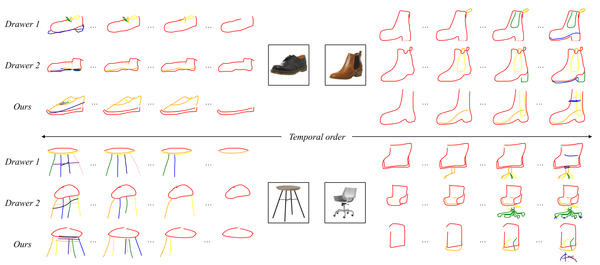

# Deep Photo-to-Sketch Synthesis Model

Before jumping in our code implementation based on [Tensorflow](https://github.com/tensorflow/tensorflow)., please refer to our paper [Learning to Sketch with Shortcut Cycle Consistency](https://arxiv.org/abs/1805.00247) for the basic idea.

This repo contains the TensorFlow code for `sketch-rnn`, the recurrent neural network model described in [Teaching Machines to Draw](https://research.googleblog.com/2017/04/teaching-machines-to-draw.html) and [A Neural Representation of Sketch Drawings](https://arxiv.org/abs/1704.03477).

# Overview

In this paper, we present a novel approach for translating an object photo to a sketch, mimicking the human sketching process. Teaching a machine to generate a sketch from a photo just like humans do is not easy. This requires not only developing an abstract concept of a visual object instance, but also knowing what, where and when to sketch the next line stroke. Figure \ref{fig:highlight} shows  that the developed photo-to-sketch synthesizer takes a photo as input and mimics the human sketching process by sequentially drawing one stroke at a time. The resulting synthesized sketches provide an abstract and semantically meaningful depiction of the given object, just like human sketches do. 

<!-- {:height="70px" width="40px"}-->
